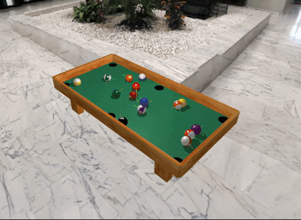
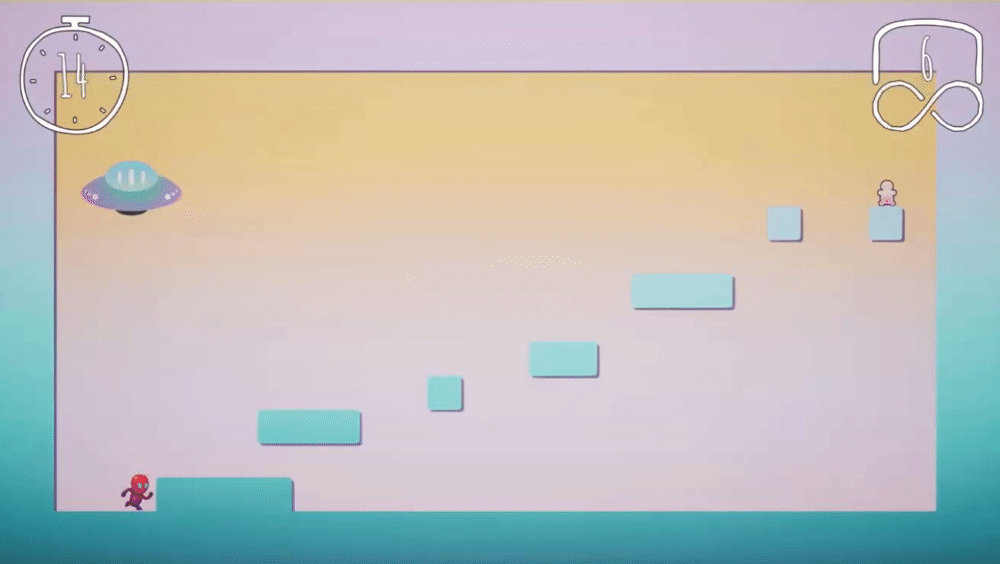

# Hi, I'm Paulina 👋
**`Software and Game Developer`**

I am passionate about creating things and solving problems. I like to think that's what makes me a great programmer - I really enjoy it! 

- 🎓 I've just graduated from my Master's Degree in Computer Science, with a final grade of **19/20** on my thesis.
- 🎮 I like **developing video games** in my free time. I have been doing that as a coordinator at [GameDev Técnico](https://gamedev.tecnico.ulisboa.pt/) for 4 years now.
- 👩‍💻 I am currently **looking to join** an interesting project and kickstart my professional career.

### Languages and Tools
🤖 C, C#, C++  
🐍 Python  
🐦 Swift  
👾 Unity, Unreal Engine  
☕ Java  
🌐 JavaScript  
🎥 OpenGL  
🐧 Linux  

### Let's Connect!
<picture>
  
</picture>
&nbsp;

<picture>
  
</picture>

---
# My Projects
I would like to highlight some of my favorite projects that I have worked on.

  

  
  
  
  <h3><a href="https://linaiz.itch.io/pool" >Pool Game</a></h3>
  <b>JavaScript, Three.js</b>
  
Pool game developed using primitve shapes, with applied textures. Physics and collisions programmed from scratch in JavaScript. Shoot the white ball and see if you manage to get any of the balls into one of the six pockets!

   

  
  
  
  <h3><a href="https://colorcrow.itch.io/time-is-ticking" >Baku - Point and Click</a></h3>
  <b>Unity, C#</b>
  
Game for the Nordic Game Jam 2023, developed in 48h. The player needs to supervise different dreams (rooms) and prevent nightmares from spawning by clicking on them as soon as they appear.

   

  
   
  <h3><a href="https://colorcrow.itch.io/time-is-ticking" >Time is Ticking - Platformer Game</a></h3>
  <b>Unreal Engine, Blueprints</b>
  
Platformer game developed in 48h for the Ludum Dare game jam. In a team of 3 people, I was tasked with creating and integrating the 2D assets in the game.

   

<!--

-->

<!--

<picture>
  <a href="https://www.linkedin.com/in/paulinawykowska/">
  <source media="(prefers-color-scheme: dark)" srcset="./img/linkedin-dark.svg">
  <source media="(prefers-color-scheme: light)" srcset="./img/linkedin-light.svg">
  
  </a>
</picture>

**Linaiz/Linaiz** is a ✨ _special_ ✨ repository because its `README.md` (this file) appears on your GitHub profile.

Here are some ideas to get you started:

- 🔭 I’m currently working on ...
- 🌱 I’m currently learning ...
- 👯 I’m looking to collaborate on ...
- 🤔 I’m looking for help with ...
- 💬 Ask me about ...
- 📫 How to reach me: ...
- 😄 Pronouns: ...
- ⚡ Fun fact: ...
-->
