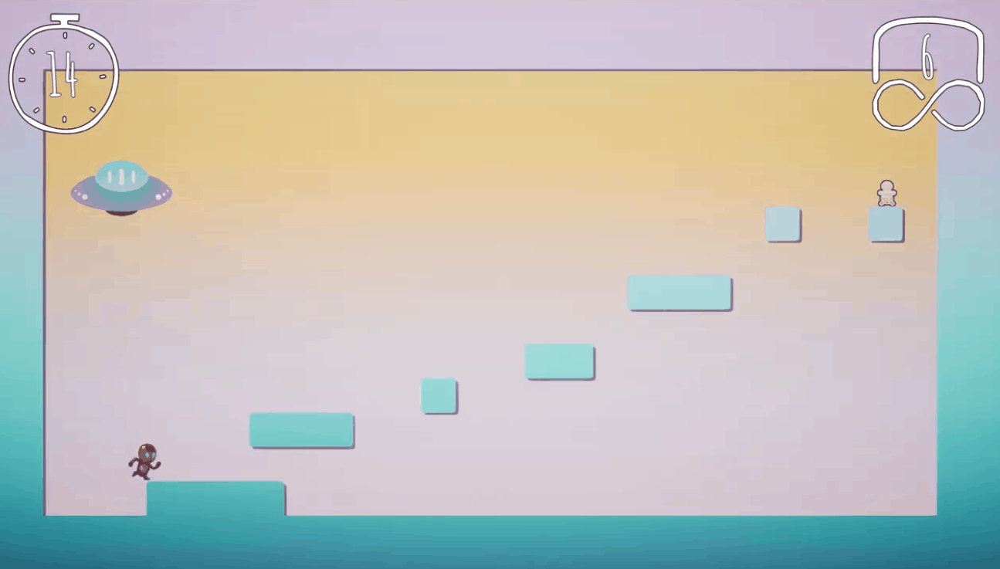
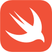
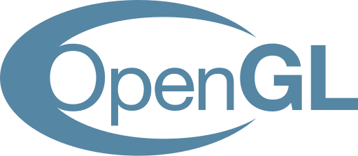

# Hi, I'm Paulina 👋
**`Software and Game Developer`**

I am passionate about creating things and solving problems. I like to think that's what makes me a great programmer - I really enjoy it! 

- 🎓 I've just graduated from my Master's Degree in Computer Science, with a final grade of **19/20** on my thesis.
- 🎮 I like **developing video games** in my free time. I have been doing that as a coordinator at [GameDev Técnico](https://gamedev.tecnico.ulisboa.pt/) for 4 years now.
- 👩‍💻 I am currently **looking to join** an interesting project and kickstart my professional career.

### Languages and Tools
🤖 C/C++, C#  
🐍 Python  
🐦 Swift  
👾 Unity, Unreal Engine  
☕ Java  
🌐 JavaScript  
🎥 OpenGL  
🐧 Linux  

### Let's Connect!
<picture>
  
</picture>
&nbsp;

<picture>
  
</picture>

---

 

<h1>My Projects</h3>

I would like to highlight some of my favorite projects that I have worked on. More of my projects can be found on my <a href="https://linaiz.itch.io/">itch.io</a>.
  
  

  
  
  
  <h3><a href="https://linaiz.itch.io/pool" >Pool Game</a></h3>
  <b>JavaScript, Three.js</b>
  
Pool game developed using primitve shapes, with applied textures. Physics and collisions programmed from scratch in JavaScript. Shoot the white ball and see if you manage to get any of the balls into one of the six pockets!

 

  
  
  
  <h3><a href="https://hamyah.itch.io/baku" >Baku - Point and Click Game</a></h3>
  <b>Unity, C#</b>
  
Game for the <b>Nordic Game Jam 2023</b>, developed in 48h. The player needs to supervise different dreams (rooms) and prevent nightmares from spawning by clicking on them as soon as they appear.

  
  
  
  <h3><a href="https://smashcart-ultra.itch.io/smashcart-ultra" >Smashcart - Multiplayer Game</a></h3>
  <b>Unity, C#</b>
  
Multiplayer game where you play as a shopping cart and compete against other players, either in Race mode or Capture The Croissant mode! I worked mostly on the UI, loading screens and animations in the game inside Unity.

 

  
  
  
  <h3><a href="https://edswordsmith.itch.io/roll-the-die" >Roll, The Die - Top Down Shooter Game</a></h3>
  <b>Unity, C#, Aseprite</b>
  
Developed in 48h for the GMTK Game Jam. The player plays as a die character. Rolling the die allows for randomly swapping between different attacks. The enemies are hands!

 

  
  
  
  <h3><a href="" >Power Pong - a twist on classic pong</a></h3>
  <b>Unity, C#, Photoshop</b>
  
Power Pong is a 2-player game. The players use their cosmic shields to deflect the incoming ball and defend their planet. Occasional power ups spawn in the game.

 

  
   
  
  <h3><a href="https://colorcrow.itch.io/time-is-ticking" >Time is Ticking - Platformer Game</a></h3>
  <b>Unreal Engine, Blueprints</b>
  
Platformer game developed in 48h for the Ludum Dare game jam. In a team of 3 people, I was tasked with creating and integrating the 2D assets in the game.

<!--

-->

<!--

<picture>
  <a href="https://www.linkedin.com/in/paulinawykowska/">
  <source media="(prefers-color-scheme: dark)" srcset="./img/linkedin-dark.svg">
  <source media="(prefers-color-scheme: light)" srcset="./img/linkedin-light.svg">
  
  </a>
</picture>

**Linaiz/Linaiz** is a ✨ _special_ ✨ repository because its `README.md` (this file) appears on your GitHub profile.

Here are some ideas to get you started:

- 🔭 I’m currently working on ...
- 🌱 I’m currently learning ...
- 👯 I’m looking to collaborate on ...
- 🤔 I’m looking for help with ...
- 💬 Ask me about ...
- 📫 How to reach me: ...
- 😄 Pronouns: ...
- ⚡ Fun fact: ...
-->
